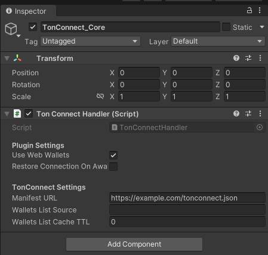

# Getting Started


This tutorial assumes that you know the basics of the C#, Unity game development and already have created Unity project.


### Installation

First of all, download latest release asset package from our [official github](https://github.com/continuation-team/unity-ton-connect/releases). After that import package in **Assets -> Import Package -> Custom Package**. When importing is done, you can open /**TonConnect/Scenes/TonSDK.Connect.Example** scene and find basic implementation of scene with Ton Connect support.


### Configuration

Next you will need to setup the config of Ton Connect on TonConnect\_Core game object:

<figure><figcaption><p>Ton Connect options</p></figcaption></figure>

* **Use Web Wallets** (only working in WebGL build) - set it to true if you want to use web wallets in game. If build isnt WebGL, it will automatically set to false.
* **Restore Connection On Awake** - set to true if you want to load last saved connection on game start. It will find is it possible to restore last connection and load it.
* **Manifest URL** - paste here your manifest url, basic manifest must be in json format, and stored in other site or filesystem with SSL domain access, below you can find example of manifest:

```json
{
  "url": "https://example.com/", // site of your application, in non webgl build use any
  "name": "Project Name", // project name, will be displayed in wallet 
  "iconUrl": "https://example.com/logo.png" // project logo, will be displayed in wallet 
}
```


### Create production build

In WebGL builds,  you must choose TC\_Minimal template, to make tonconnect working in your browser game. This template contains important tools to make this package work in WebGL build.

<figure><figcaption></figcaption></figure>


Make sure that you disable **Strip Engine Code** and set **Managed Stripping Level** to **Minimal**. Otherwise it wont work correctly in WebGL builds.



In other cases you can build your game like in any time, and it will work in all unity builds.
